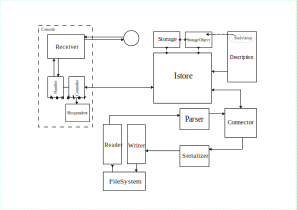
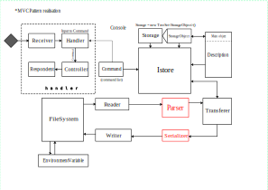
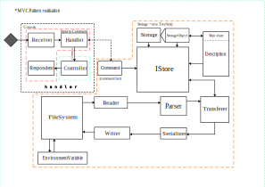

## Реализация

Будем стараться реализовывать паттерн MVC.

Стек технологий: 
* JDK 17
  * ``com.google.code.gson:gson:2.10.1``
  * ``org.projectlombok:lombok:1.18.30``
* OS Linux (Ubuntu)

### Архитектура

Перечислю этапы построения архитектуры:

Этап 1: набросок

Этап 2: не связанная файловая система

Этап 3: текущий вариант

