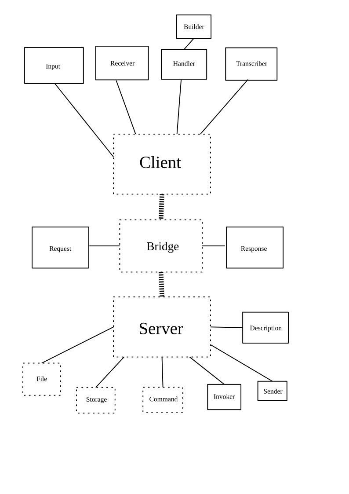

# Реализация

Придерживаемся созданного ранее, при необходимости изменяя логику работы и добавляя новое.

Просто так приведу плохой вариант, от которого пришлось отказаться.

## Основные отличия и ответственности модулей:
* Клиент и сервер теперь более отчётливо разделены: их можно даже физически отделить друг от друга.
* Пока что сервер работает в однопоточном режиме
* Добавлено логирование на стороне сервера, используется `LogBack`
* Двусторонняя валидация аргументов: сервер передаёт ``Validator`` в виде лямбда-функций клиенту
* Серверная консоль

### Inbetween
* Связь происходит через пакет ``inbetween``. В нём создаётся и обрабатывается соединение.

* ``Input -> Request -> Data -> Response -> Output``
* ``Request``, ``Response`` и ``Input`` определяются здесь для обоих сторон

### Server
* Хранит и распоряжается данными (теперь объект хранилища не параметризован: оверинжиниринг)
* Обрабатывает ``Request`` и валидирует хранящиеся в нём данные
* Исполняет команду и возвращает ``Response`` с определённым промптом
* Запрос получается в блокирующем режиме, ответ посылается в неблокирующем

### Client

* Реализует ввод со стороны клиента и отправку соответствующего вводу ``Request``. Если получен валидатор, то производит валидацию.
* Получает и расшифровывает ``Response`` так, как хотелось бы клиентской части

